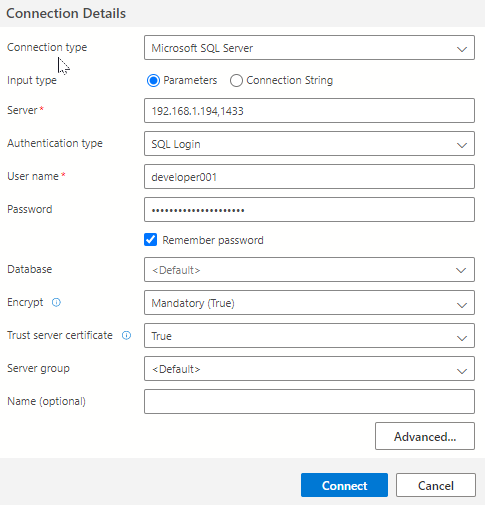
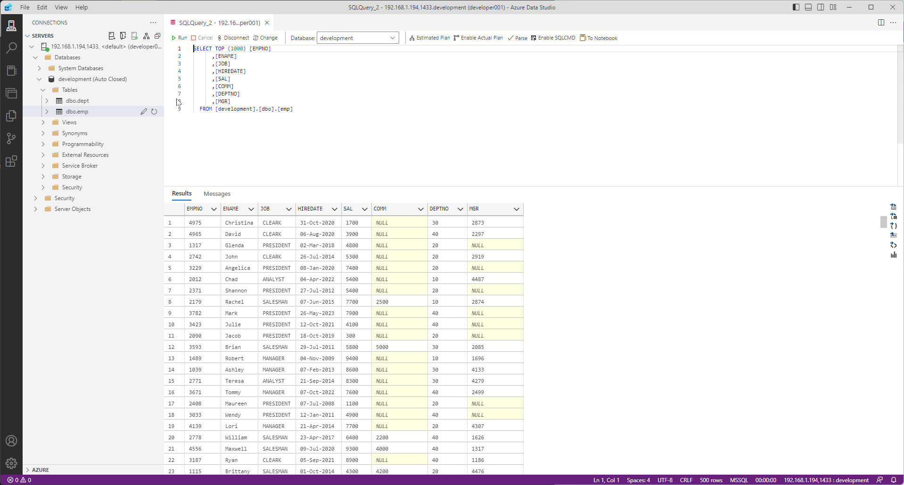

# Database-SQL-OReilly
Welcome to the SQL Mastery Repository! This repository is your gateway to mastering the art and science of Structured Query Language (SQL). As you journey through the realms of relational databases, you'll encounter hands-on exercises, code snippets, and challenges that will solidify your grasp on SQL and its intricacies, ensuring you gain a practical and deep understanding of database querying and structure.

## Why Learn SQL?
In the vast world of data, understanding SQL is paramount for several reasons:

1. **Ubiquity**: SQL is the lingua franca of data. Most relational database management systems (RDBMS) use SQL, making it an indispensable skill for data professionals.
2. **Data Retrieval & Manipulation**: SQL provides powerful means to retrieve, filter, and manipulate data, allowing for complex operations with simple, readable syntax.
3. **Optimization**: With SQL, you can optimize data retrieval operations, ensuring efficient and speedy access even with vast amounts of data.
4. **Security**: SQL offers granular control over data access, ensuring data security and integrity.
5. **Integration** : SQL databases easily integrate with various tools, platforms, and applications, making data accessibility and utilization streamlined.

# Database Comparison: MSSQL vs MySQL vs MongoDB vs Weaviate

## Overview
Choosing the right database depends on your specific project needs, including scalability, structure, performance, and ecosystem compatibility. Below is a comparison of four popular databases: **MSSQL**, **MySQL**, **MongoDB**, and **Weaviate**.

---

## Comparison Table

| **Feature**             | **MSSQL**                        | **MySQL**                       | **MongoDB**                     | **Weaviate**                     |
|--------------------------|-----------------------------------|----------------------------------|----------------------------------|-----------------------------------|
| **Database Type**        | Relational (SQL)                 | Relational (SQL)                | NoSQL (Document-based)          | Vector Database (AI-focused)     |
| **License**              | Paid (Free Developer Edition)    | Free (Community Edition)         | Free (Community), Paid (Atlas)  | Free (Open-source), Paid (Cloud) |
| **Schema**               | Strict (schema required)         | Strict (schema required)         | Flexible (schema-less)          | Schema-defined for vectors       |
| **Use Case**             | Enterprise apps, BI, analytics   | Web apps, lightweight systems   | Flexible apps, semi-structured data | AI/ML, semantic search, vector-based search |
| **Scalability**          | Vertical (large servers)         | Horizontal (replication)         | Horizontal (sharding)           | Horizontal (vector indexing)     |
| **Performance**          | High for enterprise workloads    | High for web-based workloads     | High for read/write-heavy apps  | Optimized for vector similarity  |
| **Ease of Use**          | Advanced tooling and GUI         | Simpler setup                    | Flexible, JSON-native           | Requires ML/vector understanding |
| **Query Language**       | T-SQL                            | SQL                              | MongoDB Query Language (JSON-like) | GraphQL-like                     |
| **Security**             | Advanced, enterprise-grade       | Basic, configurable              | Role-based, field-level security | API keys, SSL/TLS, user roles    |
| **Integration**          | Strong with Microsoft products   | Flexible with diverse platforms  | Cloud-native (Atlas), REST APIs | Integrates with ML/AI frameworks |
| **Community Support**    | Smaller, enterprise-focused      | Large, open-source community     | Large, open-source community    | Growing, focused community       |
| **Storage Format**       | Tables                           | Tables                           | BSON (binary JSON)              | Vector embeddings, metadata      |
| **Strength**             | Analytics, transaction-heavy apps | Simplicity, web apps             | Flexible, unstructured data     | AI/ML-driven similarity search   |
| **Weakness**             | Costly, less flexible            | Less suited for complex data     | Requires indexing for queries   | Requires vector data preparation |

---

## When to Use Each Database

### MSSQL
- **Best For**: Enterprise-grade workloads with strict schema requirements.
- **Ideal Use Case**: Complex analytics, BI, and transaction-heavy systems.
- **Strengths**: Advanced tooling, strong security, and seamless integration with Microsoft products.

### MySQL
- **Best For**: Lightweight, cost-effective web applications.
- **Ideal Use Case**: Startups and projects with moderate data complexity.
- **Strengths**: Large community, simplicity, and compatibility with diverse platforms.

### MongoDB
- **Best For**: Flexible systems handling semi-structured or unstructured data.
- **Ideal Use Case**: Real-time analytics, content management, or IoT applications.
- **Strengths**: Schema-less design, high scalability, and JSON-native queries.

### Weaviate
- **Best For**: AI/ML-powered systems requiring vector-based similarity searches.
- **Ideal Use Case**: Search engines, recommendation systems, and knowledge graphs.
- **Strengths**: Tailored for embedding-based models like CLIP or LLMs.

---


## Dive Deep into SQL!
As you embark on this enlightening journey, remember that learning SQL is not just about writing queries. It's about comprehending the philosophy of structured data, the art of relational design, and the essence of data relationships. Happy Querying!

## Setup

### Docker

Following [Install Docker Engine on Ubuntu](https://docs.docker.com/engine/install/ubuntu/) to install Docker Engine.

Please ensure to enable Non-Root User Access for Docker - [How to Fix Docker Permission Denied?](https://phoenixnap.com/kb/docker-permission-denied):
```termnial
sudo groupadd -f docker
sudo usermod -aG docker $USER
newgrp docker
```

### Docker Compose

Following [Install the Compose plugin](https://docs.docker.com/compose/install/linux/) to install Docker-Compose Plugin.
```terminal
sudo apt-get update
sudo apt-get install docker-compose-plugin
```

### SQL Related Installation

An ODBC driver uses the Open Database Connectivity (ODBC) interface by Microsoft that allows applications to access data in database management systems (DBMS) using SQL as a standard for accessing the data. ODBC permits maximum interoperability, which means a single application can access different DBMS.

Following tutorial from Microsoft - [Install the Microsoft ODBC driver for SQL Server (Linux)](https://learn.microsoft.com/en-us/sql/connect/odbc/linux-mac/installing-the-microsoft-odbc-driver-for-sql-server?view=sql-server-ver16&tabs=ubuntu18-install%2Calpine17-install%2Cdebian8-install%2Credhat7-13-install%2Crhel7-offline)

A shell script is provided and need to be executed:

```terminal
chmod +x microsoft_odbc_18_installation.sh
./microsoft_odbc_18_installation.sh
```

### Conda Environment

Create a virutal python environment and install requirements.txt

```terminal
conda env create -f environment.yml
```

**To save a conda environment**:
```terminal
conda env export | grep -v "^prefix: " > environment.yml
```

### Python Environment

If you are installing through pip

```terminal
pip install -r requirements.txt
```

**To save a python environment**:
```terminal
pip freeze > requirements.txt
```

## Execute Fixtures:
```terminal
conda activate database-env-1
python ./fixtures/data-generator.py
```


### Microsoft Azure Data Studio

You can access your MS SQL Server through Azure Data Studio, to install download the client through the following link:
- [Quickstart: Use Azure Data Studio to connect and query SQL Server](https://learn.microsoft.com/en-us/azure-data-studio/quickstart-sql-server)

Once within the client, create a new connection:



Once successfully conencted to the server, you should be able to see the following:



### How to Use This Repository:

Place Holder
- Jupyter NoteBook for Chapters